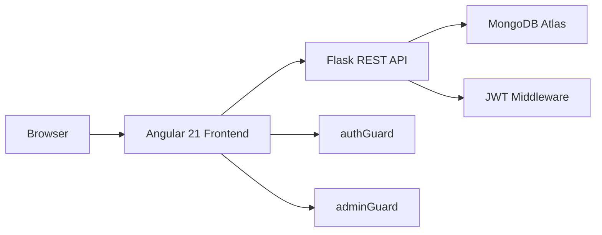
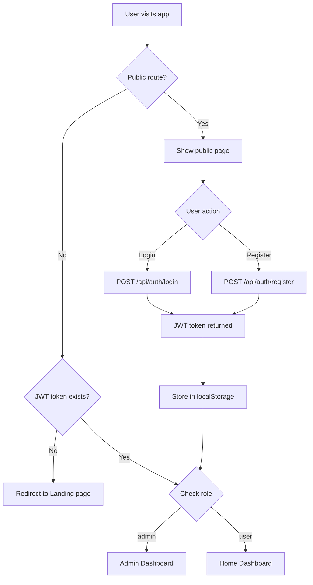

# ⚽ Football Premier League App

<div align="center">


**A full-stack Premier League web application**

*COM661 Coursework 2 — Ulster University*

**Student:** Faysal Ahamed | **ID:** B00918889

</div>

---

## 📌 Table of Contents
- [Overview](#-overview)
- [Architecture](#-architecture)
- [Authentication Flow](#-authentication-flow)
- [Features](#-features)
- [Tech Stack](#-tech-stack)
- [Project Structure](#-project-structure)
- [Setup](#-setup--installation)
- [API Reference](#-api-reference)
- [Testing](#-testing)

---

## 🌐 Overview

A fully functional Premier League management platform where users can track live scores, standings, player stats and club profiles. Administrators have full CRUD control over teams, players and matches including a real-time live match feature.

---

## 🏗️ Architecture



---

## 🔐 Authentication Flow



---

## ✨ Features

### 👤 User Features
| Feature | Description |
|---------|-------------|
| 🔐 Register / Login | JWT-based authentication |
| 🏠 Home Dashboard | Live scores, league table, fixtures |
| 📊 League Table | Real-time standings with goal difference |
| 🏟️ Team Profiles | Stadium, manager, squad stats |
| 🏃 Player Browser | Search, filter by position, full stats |
| ⚽ Match Centre | Fixtures, results, live scores |
| ⚙️ Account Settings | Update profile, set favourite team |

### ⚙️ Admin Features
| Feature | Description |
|---------|-------------|
| 📋 Dashboard | Season overview, live alert, bar chart |
| 🏟️ Manage Teams | Full CRUD for all clubs |
| 🏃 Manage Players | Full CRUD with position and team assignment |
| 📅 Manage Matches | Schedule to Go Live to Update Score to Full Time |

---

## 🛠️ Tech Stack

| Layer | Technology | Purpose |
|-------|-----------|---------|
| Frontend | Angular 21 | SPA framework |
| Language | TypeScript | Type-safe development |
| Styling | CSS3 | Custom design system |
| Backend | Python + Flask | REST API |
| Database | MongoDB Atlas | NoSQL data storage |
| Auth | JWT | Stateless authentication |
| Testing | Vitest | Unit testing |

---

## 📁 Project Structure

**Backend/**
- app.py — Main Flask app and all routes
- requirements.txt — Python dependencies
- .env — Environment variables

**frontend/prem-league-app/src/app/**
- components/ — navbar, footer
- pages/ — landing, login, register, home, teams, team-detail, players, matches, settings, admin
- admin/ — dashboard, manage-teams, manage-players, manage-matches
- services/ — auth, teams, players, matches
- guards/ — auth-guard
- models/ — team, player, match

## ⚙️ Setup & Installation

### 1️⃣ Backend

```bash
cd Backend
python3 -m venv venv
source venv/bin/activate
pip install -r requirements.txt
python app.py
```

✅ Runs at http://127.0.0.1:5000

### 2️⃣ Frontend

```bash
cd frontend/prem-league-app
npm install
ng serve
```

✅ Runs at http://localhost:4200

---

## 📡 API Reference

### Auth
| Method | Endpoint | Auth | Description |
|--------|----------|------|-------------|
| POST | /api/auth/register | ❌ | Register new user |
| POST | /api/auth/login | ❌ | Login and get JWT |

### Teams
| Method | Endpoint | Auth | Description |
|--------|----------|------|-------------|
| GET | /api/teams | ✅ User | Get all teams |
| GET | /api/teams/:id | ✅ User | Get single team |
| GET | /api/teams/table | ✅ User | Get league table |
| POST | /api/teams | 🔒 Admin | Create team |
| PUT | /api/teams/:id | 🔒 Admin | Update team |
| DELETE | /api/teams/:id | 🔒 Admin | Delete team |

### Players
| Method | Endpoint | Auth | Description |
|--------|----------|------|-------------|
| GET | /api/players | ✅ User | Get all players |
| POST | /api/players | 🔒 Admin | Create player |
| PUT | /api/players/:id | 🔒 Admin | Update player |
| DELETE | /api/players/:id | 🔒 Admin | Delete player |

### Matches
| Method | Endpoint | Auth | Description |
|--------|----------|------|-------------|
| GET | /api/matches | ✅ User | Get all matches |
| POST | /api/matches | 🔒 Admin | Schedule match |
| PUT | /api/matches/:id/start | 🔒 Admin | Go live |
| PUT | /api/matches/:id/score | 🔒 Admin | Update score |
| PUT | /api/matches/:id/finish | 🔒 Admin | Full time |
| DELETE | /api/matches/:id | 🔒 Admin | Delete match |

---

## 🧪 Testing

```bash
cd frontend/prem-league-app
npx vitest run
```
Test Files  27 passed (27)
Tests  73 passed (73)
Duration  2.95s

| Service | Status |
|---------|--------|
| AuthService | ✅ Passing |
| TeamsService | ✅ Passing |
| PlayersService | ✅ Passing |
| MatchesService | ✅ Passing |
| Route Guards | ✅ Passing |
| All Components | ✅ Passing |

---

## 🎨 Design System

| Token | Value | Usage |
|-------|-------|-------|
| Primary Dark | #0a1628 | Navbar, cards, badges |
| Secondary Dark | #0d1f3c | Gradients |
| Accent Green | #10b981 | Hover, active, CTA |
| Danger Red | #e63946 | Delete, live matches |
| Background | #f8f9fb | Page background |
| Font | Inter | All text |

---

## 👤 Test Credentials

| Role | Email | Password |
|------|-------|----------|
| 🔒 Admin | admin@test.com | admin123 |
| 👤 User | user@test.com | user123 |

---